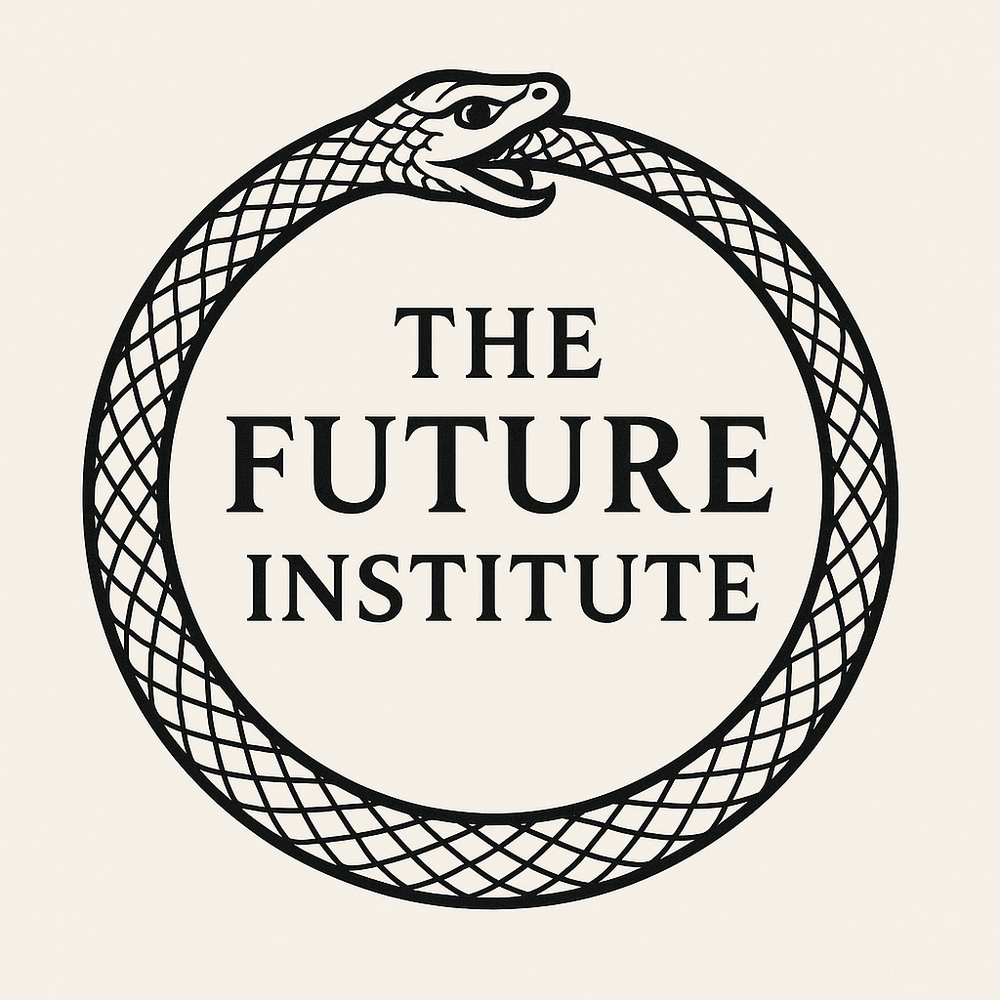

  

<h1 align="center">🌀 未来研究所 🌀</h1>
<h1 align="center">（The Future Institute）</h1>

  改变过去，塑造未来。 (Changing the past, shaping the future.)

---

## 🌌 关于我们

未来研究所致力于探索和研究人类社会的未来形态。我们的主要研究方向包括：

- ⏳ **时光机与时间旅行**：理论与实验，推动时间旅行的科学基础。
- 🏙️ **未来社会**：社会结构、经济模式、技术变革与人类生活方式的演化。
- 🕸️ **去中心化**：区块链、分布式自治组织（DAO）、新型治理模式。
- 🧠 **未来哲学**：人工智能伦理、意识、存在与未来人类价值观。
- ⚖️ **未来法律**：数字时代的法律体系、智能合约、跨时空法律挑战。

## 🚀 我们的使命

推动人类对未来的理解与实践，促进科技、社会与哲学的融合创新，为全人类的可持续发展提供理论与技术支持。

## 📚 主要项目

- **时光机原型开发**
- **未来社会模拟实验**
- **去中心化治理平台**
- **未来伦理与法律白皮书**

## 🤝 加入我们

**加入我们，或者，与我们一同改变世界的走向。**

联系方式（凯撒加密邮箱）：5584790404@ttf.frp

---
### ⚠️ 风险提示 (Risk Disclaimer)

请注意，未来研究所进行的研究具有极高的风险性。时间旅行、世界线操作以及因果律干预都可能导致无法预料的后果。加入本机构或参与相关项目，即表示您已充分理解并接受所有潜在风险，包括但不限于：时间悖论、身份错乱、世界线变动引发的现实重构等。

